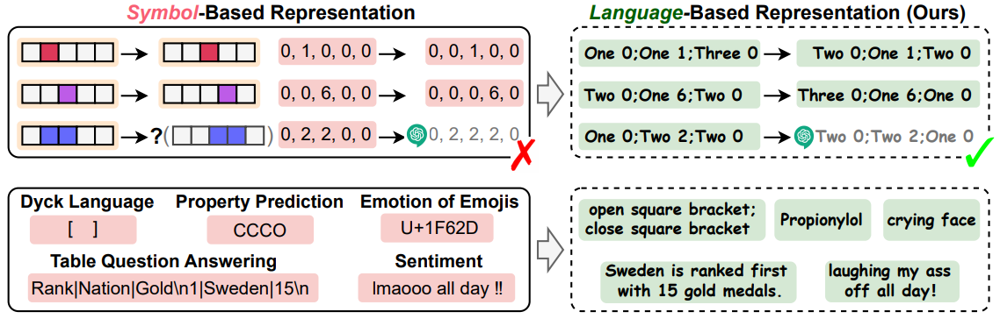
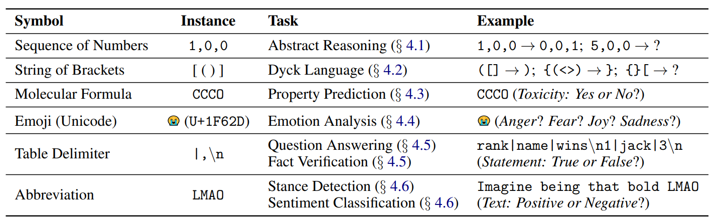

# Symbol-to-Language (S2L)
**Speak It Out: Solving Symbol-Related Problems with Symbol-to-Language Conversion for Language Models.** [arxiv](https://arxiv.org/pdf/2401.11725.pdf)



## Tasks

Please refer to the tasks in each folder, respectively.



## Contact

Thank you for your interest in our work! Please feel free to ask about any question. You can either create an issue in the github repo or contact us at wangyile AT air.tsinghua.edu.cn

## Citation

```bibtex
@article{wang2024speak,
  title={Speak It Out: Solving Symbol-Related Problems with Symbol-to-Language Conversion for Language Models},
  author={Wang, Yile and Cheng, Sijie and Sun, Zixin and Li, Peng and Liu, Yang},
  journal={arXiv preprint arXiv:2401.11725},
  year={2024}
}
```